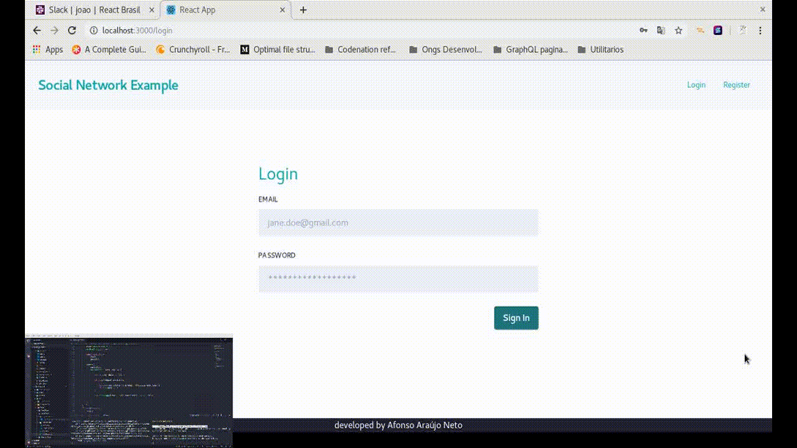
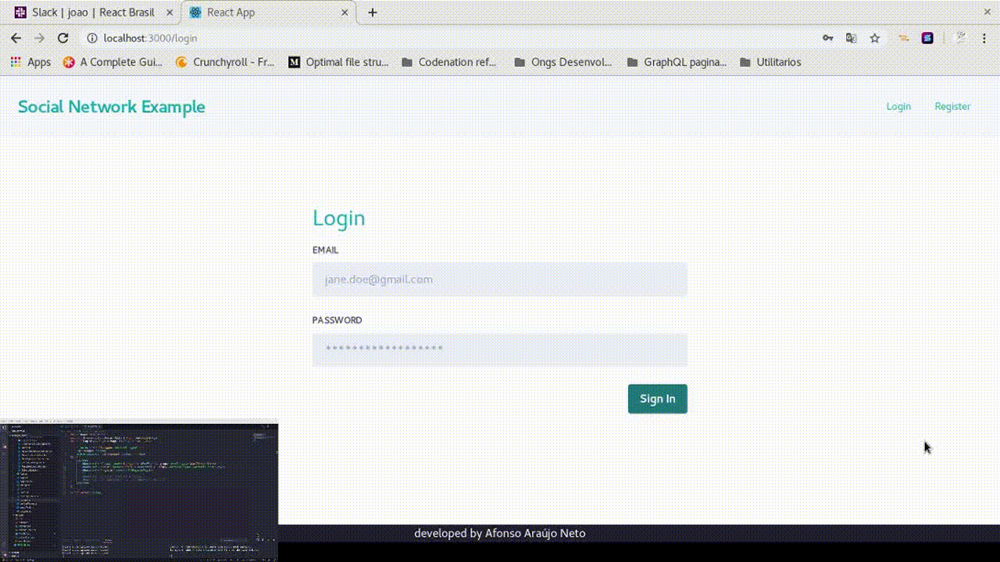

## Social Network Frontend

This is a Relay client to consume the backend graphql api.

## To Run

Execute `yarn install` or `npm install` depending on your local package manager. To install all dependencies

Execute `yarn start` or `npm start` depending on your local package manager. To run the frontend web client.

## Examples

### User creation and login

### Post creation and reply

